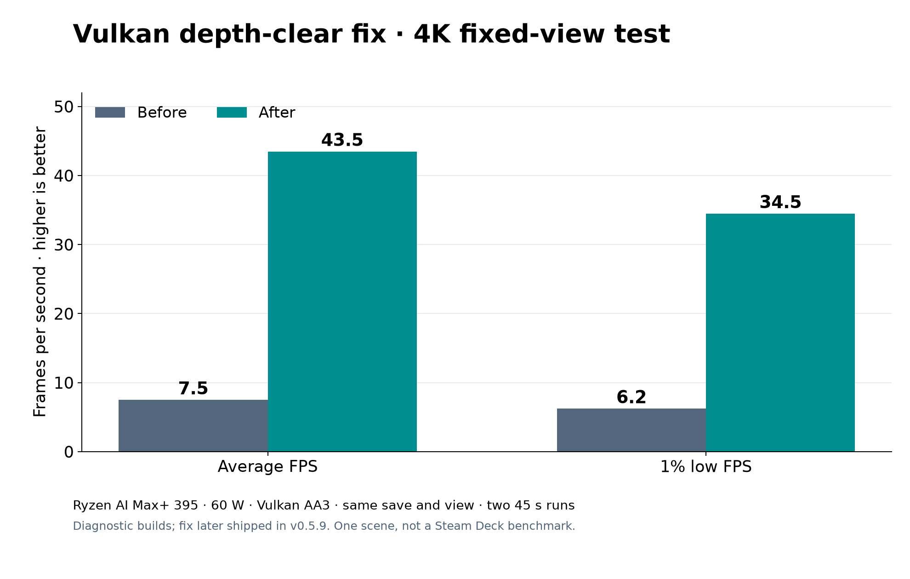

# Lost Odyssey Recomp v0.6.0 — This one means a lot to me

Hey r/recomps! When I posted v0.5.0, I finally had a moment to write something other than a crash report. I may have spoken too soon. I've spent an unreasonable amount of time since then chasing bugs, comparing frames, staring at logs, and trying to make this game run better on hardware that wasn't on my desk.

v0.6.0 is the next milestone, and I'm really excited about it. Many fixes started with someone saying, “This looks wrong here,” then showing me exactly where.

The big changes since v0.5.0:

- Crashes and hangs, the black lights in Numara Castle, flickering stairs and save points, subtitle problems, and importer and updater failures have all received fixes. There are still open issues, but the game is in a far better place than it was at our first milestone.
- There's now a Linux x64 AppImage alongside the Windows build. Some Steam Deck players told me v0.5.0 couldn't always hold 30 FPS. I expect v0.6.0 to feel better on Deck after the performance work, though I still need results from Deck hardware. I'd love to hear how it runs for you.
- I'm including as many shared shaders as I can in the bundled packs so you can get into the game without a long startup compile. Some scenes may still need shaders we haven't captured yet. The first encounter could stutter briefly; I'll keep filling those gaps as we find them.
- I've worked on CPU waits, repeated index conversion, shader preparation, and cache behavior. Performance varies by scene and machine, but this is the largest performance push I've made for the project so far.
- The in-game F1 menu, render-state captures, and clearer logs make it easier to turn a strange screenshot or crash into something I can investigate.

The most striking result came from fixing a Vulkan depth-clear bottleneck. In a matched, static 4K test on my Ryzen AI Max+ 395 at 60 W, average performance jumped from **7.5 to 43.5 FPS**. The fix has since shipped, though those numbers came from diagnostic builds in that one scene. They aren't a whole-game or Steam Deck benchmark.

I won't call it a finished port yet. I still haven't verified a complete playthrough, and some scenes, GPUs, and Linux setups need more testing. But getting from “it boots” to a release I can play, debug, and improve across Windows and Linux has taken an enormous amount of work. I'm proud of this milestone.

**Looking ahead to v0.7.0:** I'll keep pushing performance and add more quality-of-life features. DLSS and FSR scaling, frame generation, and a macOS release are on the roadmap. Those are goals for the next milestone, not features in v0.6.0; the graphics features need proper game-motion inputs and validation before I can call them ready.

Thank you to everyone filing issues, sharing captures, and helping me test the places I can't reach alone. And especially to **Cristian** and **Whitesun**, who supported the project on Ko-fi. You've helped me keep working on it.

[Latest release](https://github.com/freefrank/LostOdysseyRecomp/releases/latest) · [Source](https://github.com/freefrank/LostOdysseyRecomp) · [Report a bug](https://github.com/freefrank/LostOdysseyRecomp/issues)

Bring your own supported game data. If something breaks, please include the log from that run; for visual bugs, **F1 → Capture render state** exports a ZIP you can attach to an issue.
